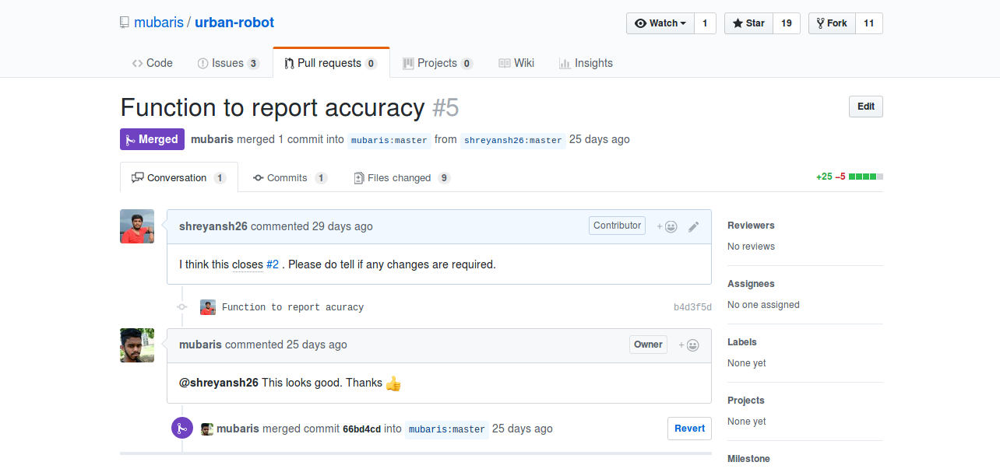
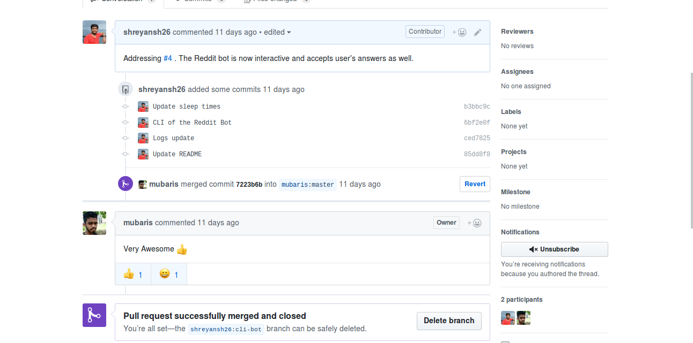

# KWoC – KHARAGPUR WINTER OF CODE

A one month long program for introduction to open source community and a providing preface to budding developers to Google Summer of Code’ 2017. Organised by students at Kharagpur Open Source Society (KOSS), IIT Kharagpur.

# Choosing the Project

I went through the descriptions of all the projects registered in KWoC'17. Since I was just getting started in the world of NLP, I decide to work on a project based on the same. So, I chose [**urban-robot**](https://github.com/mubaris/urban-robot). It is a Reddit bot which replies to sarcastic comments. My mentor for this project was [Mubaris NK](https://github.com/mubaris).

# Progress

I forked and cloned the repo, installed all the dependencies, set up a Reddit App, updated some config files (like `praw.ini`) and I was ready with my development environment.

## [Pull Request-1 (December 4, 2017)](https://github.com/mubaris/urban-robot/pull/5)

The first issue was quite simple, I had to just make the output of accuracies of the bot (using the various ML models), output in a single file rather than on the console.

I added some code for that and sent my first PR. He reviewed it and merged it in a few days.

## [Pull Request-2 (December 22, 2017)](https://github.com/mubaris/urban-robot/pull/6)

Another issue mentioned the prospect of converting the project into a command-line based chatbot. I took up the task of doing it, and added options for the user to choose to respond to sarcastic comments on Reddit himself/herself or let the bot do that itself or even to leave the comment as it is. Well, we don't want to interfere in something we don't have knowledge about, do we !?

So I wrote a separate file with the code for the CLI based bot. I tested it throughly and sent a PR. My mentor reviewed it and merged it immediately.

# Verdict

KWoC was my first experience with proper Open Source contributions and development. It felt good seeing the PRs getting merged. It was a great learning experience.
